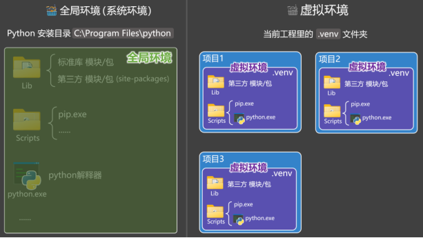

## 模块
### 模块概述
- 在 Python 中，一个.py文件就是一个模块（Module）。
- 模块中可以包含：变量、函数、类、等很多内容。
- 通常把能够实现某一特定功能的代码，集中放在一个模块中（模块就类似于一个工具箱）。
- 模块可以提高代码的可维护性 与 可复用性，还可以避免命名冲突。


### 模块的分类
Python 中的模块分为三类，分别是：标准库模块、自定义模块、第三方模块。

### 创建模块
模块命名注意点：

    
1.要符合标识符命名规则
2.模块名（.py文件名）区分大小写
3.不要与标准库模块同名（一旦同名，Python会优先引入标准库模块）


### 导入模块

```python
import 模块名
导入全部模块


import 模块名 as 别名


from 模块名 import 具体内容1, 具体内容2, ......


from 模块名 import 具体内容 as 别名


from 模块名 import *
```

##  __all__ 与 __name__
### 关于__all__：
- 在 Python 模块中，可通过 __all__ 来控制【from 模块 import *】能导入哪些内容。
- __all__ 的值可以是：列表、元组。

### 关于__name__:
__name__是每个 Python 模块（.py文件）都拥有的一个内置变量。

它的具体值取决于模块的运行方式：
(1). 作为主程序直接运行，__name__ 的值是 __main__
(2). 作为模块被导入到其他程序中运行，__name__的模块的文件名（不带.py）。


## 标准库模块
1.Python 中的模块分为三类，分别是：标准库模块、自定义模块、第三方模块。
2.标准库模块：随着 Python 一起安装在我们电脑上的那些模块。
3.有一些标准库模块是用C语言实现的，这些用C语言实现的模块，又称：【内置模块】。
标准库模块保存在Python安装目录中的Lib文件夹中，但内置模块无法在Lib中看到。

## 包
### 概述
包是一种组织模块的方式，包中可以包含：各种模块、子包、其他资源等。

在 Python 中，【包含__init__.py 的文件夹】就是一个包（Package）。

我们通常会把【某个特定功能相关的所有模块】放入一个包中。

使用包可以进一步提升代码的：可维护性、可复用性，便于管理大型项目。


### 包与模块的关系
一个模块就是一个.py文件 ，包是用来“管理模块”的目录(文件夹)。

一个包中可以有多个模块，也可以有多个子包。

### 包的分类
Python 中的包分为三类，分别是：标准库包、自定义包、第三方包。

### 创建包
包命名注意点：
1.要符合标识符命名规范。
2.包名区分大小写（建议全部使用小写字母）
3.不要与标准库包同名。


### 导入包

```python
import 包名.模块名

import 包名.模块名 as 别名


from 包名.模块名 import 具体内容1

from 包名.模块名 import 具体内容 as 别名

from 包名.模块名 import *


from 包名 import 模块名

from 包名 import 模块名 as 别名

from 包名 import *


import 包名
想通过import 包名形式进行引入，就必须在__init__.py中定义好具体的内容


相对导入语法说明
from . import order1 - 导入同一包内的 order1 模块
from .order1 import create_order - 导入同一包内 order1 模块的 create_order 函数
from .. import xxx - 导入父包中的模块
```

### __init__.py

1. __init__.py 是包的初始化文件，在包被导入时，__init__.py 会被自动调用
2. __init__.py 中可以编写一些包的初始化逻辑
3. __init__.py 中所定义的内容，会被 from 包名 import * 形式全部引入
4. __init__.py 中也可以使用 `__all__` 来控制包中的哪些模块可以被from 包名 import * 引入


### 引入子包
以上引入方式，都可以用于引入子包，只需要在包名的后面跟上子包名即可


## 第三方包
### 概述
PyPI 是是 Python 官方推荐、官方维护的包发布与分发平台（https://pypi.org）

pip是Python包管理工具，该工具提供了对 Python 包的查找、下载、安装、卸载的功能。

pip 默认的源是 PyPI，其地址为 ，如果下载比较慢，还可以指定其它的源。

备注：以下网址不推荐在浏览器中访问，正确用法是结合命令去使用（后面有讲解）
```
1.清华大学： https://pypi.tuna.tsinghua.edu.cn/simple
2.阿里云： https://mirrors.aliyun.com/pypi/simple
3.中国科技大学： https://pypi.mirrors.ustc.edu.cn/simple
```

### pip 常用命令
```shell
pip install 包名	安装指定的包。
pip install -i 镜像地址 包名	临时使用镜像地址安装指定包。
pip config set global.index-url 地址	设置 pip 所使用的镜像地址。
pip config list	查看当前环境的 pip 配置。
pip config unset global.index-url	让 pip 恢复使用官方默认的地址。
pip list	列出当前环境中，已安装的所有第三方包。
pip uninstall 包名	从当前环境中卸载指定的第三方包。
```

## 全局环境 VS 虚拟环境

什么是环境？ —— 所谓环境就是指：python 解释器 + 依赖包。

Python 环境分类两种，分别是全局环境（系统环境）、虚拟环境。

所有项目共用全局环境容易互相影响和干扰，虚拟环境可以解决这个问题，二者结构如下图：

1. 图中的 Python 安装目录中的文件，构成了全局环境（系统环境）。
2. 图中的.venv中的文件构成了虚拟环境。
3. 虚拟环境有自己独立的一套：Python 解释器、pip 命令、第三方依赖包，不和其它项目产生干扰。
4. 虚拟环境和全局环境共用的东西，只有标准库。

在cmd中不做任何处理，直接通过pip安装的包，都是安装在了全局环境中，如果想在虚拟环境中安装包，需要切到虚拟环境目录后，通过activate命令切换到虚拟环境。使用deactivate可以退出虚拟环境。